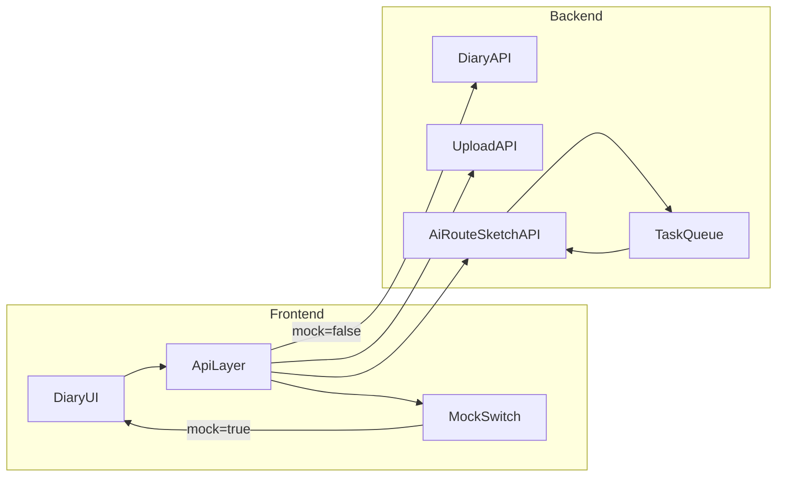

# 旅游日记模块分阶段实施计划

## 目标与范围
- 先完成可用的纸质手账基础能力（模板+编辑+上传+保存）。
- 首期 AI 仅保留“手绘风路线图生成”接口占位，先返回 mock 结果（静态图 URL + 任务状态）。
- 二期再接真实 AI 能力（路线图模型与 AI 文案生成）。

## 是否需要前后端协调
- 需要，而且建议从 Day 1 就协同接口契约。你现在选的 `mock_first` 很适合先并行推进：
  - 前端先用 mock 快速把交互跑通。
  - 后端按同一份契约实现接口，后续前端只切换 `baseURL`。
- 关键协同点：
  - **数据结构**：日记本、页面内容块、素材、模板配置。
  - **上传策略**：直传对象存储还是经后端中转。
  - **AI 任务机制**：同步返回 vs 异步任务（推荐异步）。

## 分阶段执行

### Phase 0：契约与信息架构（0.5-1 天）
- 在前端先抽离 diary 领域模型，避免继续依赖静态 `Notebook` 扁平结构：
  - 当前来源：[c:\Users\Lenovo\Desktop\trip\cursor\src\data\siteData.ts](c:\Users\Lenovo\Desktop\trip\cursor\src\data\siteData.ts)
  - 当前页面：[c:\Users\Lenovo\Desktop\trip\cursor\src\pages\DiaryPage.tsx](c:\Users\Lenovo\Desktop\trip\cursor\src\pages\DiaryPage.tsx)
- 先定义统一 DTO（建议）：
  - `DiaryBook`：id、title、cover、startDate、days、templateId
  - `DiaryEntry`：bookId、dayIndex、title、contentBlocks[]（text/image/map）
  - `Asset`：id、url、width、height、mime、size
  - `RouteSketchTask`：taskId、status、resultUrl、error

### Phase 1：前端手账 MVP（2-4 天）
- 页面重构为“模板化编辑器”而不是纯展示：
  - 左侧：手账本列表 + 新建。
  - 中部：封面区（可替换封面）+ Day 卡片。
  - 编辑区：
    - 用户手动输入文字（主路径）。
    - 上传本地照片并插入内容块。
    - 保留“AI续写”按钮但先接 mock。
- 推荐新增结构：
  - `src/features/diary/components/*`（封面、纸张、编辑器块）
  - `src/features/diary/types.ts`
  - `src/features/diary/mock.ts`

### Phase 2：Mock API 与可切换数据层（1-2 天）
- 新建前端 API 层（不要直接在页面里写请求）：
  - `src/api/diary.ts`、`src/api/ai.ts`
- 新增环境变量：
  - `VITE_API_BASE_URL`
  - `VITE_USE_MOCK=true|false`
- 首期接口（mock）：
  - `GET /diary/books`
  - `POST /diary/books`
  - `PATCH /diary/books/:id`
  - `POST /assets/upload`（先 mock URL）
  - `POST /ai/route-sketch`（先 mock taskId/resultUrl）

### Phase 3：后端联调接入（1-2 天）
- 只替换 API 实现，不改 UI 组件层。
- 联调重点：
  - 鉴权（用户级数据隔离）
  - 上传链路（大小限制、格式限制、失败重试）
  - AI 任务状态查询（`/ai/tasks/:id`）

### Phase 4：二期创新（AI 真实生成）
- 真实手绘路线图生成：
  - 输入：出发地、停靠点、天数、偏好、风格模板。
  - 输出：生成图 URL + 可下载。
- AI 文案生成：
  - 输入：路线信息 + 用户上传照片元数据。
  - 输出：分段日记草稿（用户可编辑）。

## 建议前后端协作图

## 你是否需要提供封面/纸张素材
- 需要，且越早提供越好。首期建议最小素材包：
  - 封面图 3-5 张（横版优先）
  - 纸张纹理 2-3 张（米白、泛黄、淡网格）
  - 可选贴纸/胶带 PNG 10-20 个（透明背景）

## 素材提供规范（直接按这个给就行）
- 建议目录（你给我素材后我按此落库）：
  - `assets/diary/covers/`
  - `assets/diary/papers/`
  - `assets/diary/stickers/`
- 推荐格式与尺寸：
  - 封面：`jpg/webp`，长边 `1920px+`
  - 纸张：无缝纹理优先，`jpg/png`，`2048x2048` 或 `A4比例`
  - 贴纸：`png` 透明底，单边 `512-1024px`
- 命名规则：
  - `cover_warm_01.jpg`
  - `paper_fiber_01.jpg`
  - `sticker_tape_01.png`

## 当前代码上的落点（首批会改的重点文件）
- 当前日记页面：
  - [c:\Users\Lenovo\Desktop\trip\cursor\src\pages\DiaryPage.tsx](c:\Users\Lenovo\Desktop\trip\cursor\src\pages\DiaryPage.tsx)
- 当前静态数据定义：
  - [c:\Users\Lenovo\Desktop\trip\cursor\src\data\siteData.ts](c:\Users\Lenovo\Desktop\trip\cursor\src\data\siteData.ts)
- 全局布局（背景策略可继续保留日记专属风格）：
  - [c:\Users\Lenovo\Desktop\trip\cursor\src\components\layout\AppShell.tsx](c:\Users\Lenovo\Desktop\trip\cursor\src\components\layout\AppShell.tsx)

## 里程碑验收（MVP 完成标准）
- 可以新建手账本并保存基础信息。
- 可以上传本地照片并插入到日记内容块。
- 可以手动输入与编辑日记文字。
- AI 路线图按钮可触发 mock 接口并展示返回图。
- 所有数据请求均通过 API 层，可一键切换 mock/真实后端。