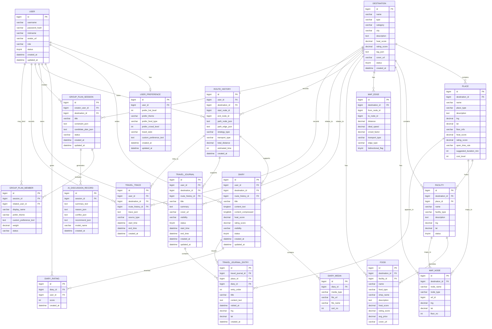

- 作用：记录数据库 “ER 图 + 关系解释”。

# 实体关系模型说明（ER Model）

## 1. 文档用途
本文件用于说明本项目数据库的实体关系模型（ER Model），重点描述：

- 系统中有哪些核心实体
- 各实体之间是什么关系
- 这些关系如何支撑系统的业务主线
- 当前 ER 设计如何服务推荐、路线规划、周边设施查询、日记管理等功能
- 后续数据库扩展时应优先保持哪些主关系不被破坏

本文件主要关注“实体和关系层面”的结构设计，不替代字段级详细说明。  
字段级说明请参见：

- `project-root/docs/03_data/schema.md`
- `project-root/docs/03_data/data-dictionary.md`

---

## 2. ER 模型设计目标

本项目的 ER 模型围绕三条业务主线展开：

1. **旅游前**：目的地推荐与查询  
2. **旅游中**：目的地内部路径规划、设施查询与美食推荐  
3. **旅游后**：旅游日记发布、浏览、评分、手账基础形态与后续扩展  

因此，ER 模型的设计目标是：

- 支撑多用户系统
- 支撑用户偏好输入
- 支撑景区 / 校园等目的地的统一建模
- 支撑目的地内部空间对象与图结构建模
- 支撑日记内容与媒体资源管理
- 支撑路线记录与后续回顾能力
- 为手账式旅行记录、多人协同决策、轨迹回顾等创新功能预留扩展空间

---

## 3. 当前 ER 图

> 上图反映了当前主线数据库实体，以及为手账式旅行记录、多人协同决策、轨迹回顾预留的扩展实体和关系。  
> 其中 `TRAVEL_JOURNAL`、`TRAVEL_JOURNAL_ENTRY`、`GROUP_PLAN_SESSION`、`GROUP_PLAN_MEMBER`、`AI_DISCUSSION_RECORD`、`TRAVEL_TRACE` 当前可以作为设计预留，不要求第一阶段全部立即落表。

---

## 4. ER 模型总体结构说明

从整体上看，当前 ER 模型可以分为 7 个关系域：

### 4.1 用户域

包括：

- `USER`
- `USER_PREFERENCE`

该部分负责支撑多用户、登录身份和个性化偏好输入。

### 4.2 目的地与空间域

包括：

- `DESTINATION`
- `PLACE`
- `FACILITY`
- `MAP_NODE`
- `MAP_EDGE`

该部分负责支撑推荐入口、目的地内部空间表达、路径规划和周边设施查询。

### 4.3 美食域

包括：

- `FOOD`

该部分负责目的地相关的美食信息管理和推荐展示。

### 4.4 日记内容域

包括：

- `DIARY`
- `DIARY_MEDIA`
- `DIARY_RATING`

该部分负责旅游日记的主体内容、媒体资源和评分信息。

### 4.5 过程记录域

包括：

- `ROUTE_HISTORY`

该部分负责保存用户的历史路径结果，为后续“我的路线”“路线回顾”“日记联动”提供支撑。

### 4.6 手账记录域（预留扩展）

包括：

- `TRAVEL_JOURNAL`
- `TRAVEL_JOURNAL_ENTRY`

该部分负责承接一次旅行的完整记录结构，是 Diary 模块从“单篇日记”向“手账式旅行记录”扩展时的主要实体域。

### 4.7 协同决策与轨迹扩展域（预留扩展）

包括：

- `GROUP_PLAN_SESSION`
- `GROUP_PLAN_MEMBER`
- `AI_DISCUSSION_RECORD`
- `TRAVEL_TRACE`

该部分负责承接多人规划协商、AI 协商摘要与轨迹记录等创新需求。

---

## 5. 核心实体说明

## 5.1 USER

`USER` 是系统中的基础实体，用于表示系统用户。  
它与偏好、日记、评分、路线记录、手账、协商会话和轨迹等多个实体直接关联，是整个系统用户侧能力的起点。

### 作用

- 支撑注册与登录
- 支撑用户身份标识
- 支撑用户个性化能力
- 支撑用户内容发布与行为记录

---

## 5.2 USER_PREFERENCE

`USER_PREFERENCE` 用于表达用户的旅游偏好，是推荐模块、AI 推荐解释和多人协同决策的重要输入来源。

### 作用

- 存储用户对热门程度、主题、菜系、拥挤度、旅游风格的偏好
- 存储自由偏好描述
- 为多维推荐提供基础数据支持
- 为多人规划参与者偏好快照提供结构参考

### 关系特点

- 当前按 `USER` 与 `USER_PREFERENCE` 的 **一对一** 关系设计

---

## 5.3 DESTINATION

`DESTINATION` 是目的地实体，统一表示景区、校园等可推荐对象，是推荐、搜索、路线规划、日记关联和后续协同规划的共同入口。

### 作用

- 支撑旅游推荐
- 支撑搜索与筛选
- 作为内部空间建模的根对象
- 作为日记与路线记录的关联对象
- 作为多人规划会话和手账记录的关联对象

### 关系特点

`DESTINATION` 是当前 ER 模型中最核心的聚合实体之一，它向下关联：

- 多个 `PLACE`
- 多个 `FACILITY`
- 多个 `MAP_NODE`
- 多条 `MAP_EDGE`
- 多个 `FOOD`
- 多篇 `DIARY`
- 多条 `ROUTE_HISTORY`
- 多份 `TRAVEL_JOURNAL`
- 多次 `GROUP_PLAN_SESSION`
- 多条 `TRAVEL_TRACE`

---

## 5.4 PLACE

`PLACE` 表示目的地内部的景点、教学楼、办公楼、宿舍楼等场所，是空间语义层的核心实体。

### 作用

- 表达用户可感知的具体场所
- 提供目的地内部查询对象
- 为设施归属和地图节点映射提供中间层
- 为后续开放时间、建议游玩时长、性价比等增强维度提供承载字段

### 关系特点

- 一个 `DESTINATION` 包含多个 `PLACE`
- 一个 `PLACE` 可以承载多个 `FACILITY`
- 一个 `PLACE` 可以映射到一个或多个 `MAP_NODE`
- 一个 `PLACE` 后续可出现在多个 `TRAVEL_JOURNAL_ENTRY` 中

---

## 5.5 FACILITY

`FACILITY` 表示厕所、食堂、超市、图书馆、咖啡馆等服务设施，是旅游中“周边查询”功能的核心实体。

### 作用

- 支撑附近设施查询
- 支撑按类别过滤
- 支撑周边可达距离排序
- 为美食信息提供挂载点

### 关系特点

- 一个 `DESTINATION` 包含多个 `FACILITY`
- 一个 `PLACE` 可承载多个 `FACILITY`
- 一个 `FACILITY` 可进一步关联多个 `FOOD`
- 一个 `FACILITY` 也可映射到一个或多个 `MAP_NODE`

---

## 5.6 MAP_NODE 与 MAP_EDGE

这两个实体共同构成目的地内部的图结构，是路径规划和可达性计算的直接支撑。

### MAP_NODE 的作用

- 表示图中的节点
- 节点可代表路口、建筑、设施点

### MAP_EDGE 的作用

- 表示图中的边
- 支撑最短距离、最短时间、多点路径等能力

### 关系特点

- 一个 `DESTINATION` 关联多个 `MAP_NODE`
- 一个 `DESTINATION` 关联多条 `MAP_EDGE`
- `MAP_EDGE` 通过 `from_node_id` 与 `to_node_id` 连接节点
- `MAP_NODE` 可以与 `PLACE`、`FACILITY` 做映射关联

---

## 5.7 FOOD

`FOOD` 用于保存美食相关信息，是美食推荐功能的数据基础。

### 作用

- 提供目的地下的美食数据
- 支持按名称、菜系、店铺查询
- 支持按热度、评分、价格等维度排序或筛选

### 关系特点

- 一个 `DESTINATION` 有多个 `FOOD`
- 一个 `FACILITY` 可以提供多个 `FOOD`

---

## 5.8 DIARY

`DIARY` 是旅游日记主体实体，用于保存用户发布的文本内容，并与目的地和用户直接关联。

### 作用

- 支撑日记发布
- 支撑日记浏览与详情展示
- 支撑按目的地查看相关日记
- 支撑公开 / 私有控制
- 为评分、媒体、检索、路线联动等后续能力提供主对象

### 关系特点

- 一个 `USER` 可以发布多篇 `DIARY`
- 一个 `DESTINATION` 关联多篇 `DIARY`
- 一篇 `DIARY` 包含多个 `DIARY_MEDIA`
- 一篇 `DIARY` 接收多个 `DIARY_RATING`
- 一篇 `DIARY` 可选关联一条 `ROUTE_HISTORY`
- 一篇 `DIARY` 后续可被 `TRAVEL_JOURNAL_ENTRY` 复用

---

## 5.9 DIARY_MEDIA

`DIARY_MEDIA` 用于保存日记关联的图片、视频等媒体资源元数据。

### 作用

- 支撑图文日记
- 为多媒体扩展留空间
- 控制媒体展示顺序
- 为后续图片摘要与手账增强提供素材来源

### 关系特点

- 一篇 `DIARY` 对应多个 `DIARY_MEDIA`

---

## 5.10 DIARY_RATING

`DIARY_RATING` 用于保存用户对日记的评分行为，是日记热度、评分展示和排序的重要依据。

### 作用

- 支撑评分功能
- 支撑按评分排序
- 可反哺推荐或内容热度计算

### 关系特点

- 一个 `USER` 可对多篇 `DIARY` 评分
- 一篇 `DIARY` 可收到多个评分

---

## 5.11 ROUTE_HISTORY

`ROUTE_HISTORY` 用于保存用户历史规划路线，是过程记录类实体。

### 作用

- 支撑“我的路线”或“历史路线”
- 支撑路径回顾输入
- 支撑后续路线与日记联动
- 为 AI 日记生成或路线复盘提供素材
- 为后续轨迹记录关联提供基础对象

### 关系特点

- 一个 `USER` 可拥有多条 `ROUTE_HISTORY`
- 一个 `DESTINATION` 可关联多条 `ROUTE_HISTORY`
- 一条 `ROUTE_HISTORY` 可被多篇 `DIARY` 引用
- 一条 `ROUTE_HISTORY` 后续可被一份 `TRAVEL_JOURNAL` 关联
- 一条 `ROUTE_HISTORY` 后续可关联多条 `TRAVEL_TRACE`

---

## 5.12 TRAVEL_JOURNAL

`TRAVEL_JOURNAL` 用于表达“一次完整旅行记录”，是后续手账式旅行记录从单篇日记扩展为独立对象时的主实体。

### 作用

- 支撑一次旅行的整体记录
- 组织多个地点条目
- 与路线记录形成更完整的“旅行回顾”对象
- 承接公开 / 私有状态与封面、摘要等手账属性

### 关系特点

- 一个 `USER` 可以拥有多份 `TRAVEL_JOURNAL`
- 一个 `DESTINATION` 关联多份 `TRAVEL_JOURNAL`
- 一份 `TRAVEL_JOURNAL` 可关联一条 `ROUTE_HISTORY`
- 一份 `TRAVEL_JOURNAL` 包含多个 `TRAVEL_JOURNAL_ENTRY`

---

## 5.13 TRAVEL_JOURNAL_ENTRY

`TRAVEL_JOURNAL_ENTRY` 用于表达一次旅行中的单个地点条目、内容片段或时间顺序信息。

### 作用

- 记录手账中的地点顺序
- 复用已有日记内容
- 组织一次旅行中分散的地点、文字、图片线索

### 关系特点

- 一个 `TRAVEL_JOURNAL` 包含多个 `TRAVEL_JOURNAL_ENTRY`
- 一个 `TRAVEL_JOURNAL_ENTRY` 可关联某个 `PLACE`
- 一个 `TRAVEL_JOURNAL_ENTRY` 可关联某篇 `DIARY`

---

## 5.14 GROUP_PLAN_SESSION

`GROUP_PLAN_SESSION` 用于表达一次多人旅游规划协商会话。

### 作用

- 保存多人规划的基础会话信息
- 挂载约束条件和候选方案
- 为 AI 协商摘要提供主对象

### 关系特点

- 一个 `USER` 可以创建多个 `GROUP_PLAN_SESSION`
- 一个 `DESTINATION` 可关联多个 `GROUP_PLAN_SESSION`
- 一个 `GROUP_PLAN_SESSION` 包含多个 `GROUP_PLAN_MEMBER`
- 一个 `GROUP_PLAN_SESSION` 可关联多个 `AI_DISCUSSION_RECORD`

---

## 5.15 GROUP_PLAN_MEMBER

`GROUP_PLAN_MEMBER` 用于保存一次多人规划中参与者的偏好快照。

### 作用

- 保存每位成员的偏好输入
- 支撑偏好冲突分析
- 为 AI 协商过程提供上下文

### 关系特点

- 一个 `GROUP_PLAN_SESSION` 包含多个 `GROUP_PLAN_MEMBER`
- 某个成员可选关联系统中的 `USER`

---

## 5.16 AI_DISCUSSION_RECORD

`AI_DISCUSSION_RECORD` 用于保存 AI 对多人规划的讨论摘要、冲突点说明、推荐理由等结果。

### 作用

- 支撑多人协同规划结果留档
- 支撑后续会话回看
- 为推荐理由、折中方案和答辩展示提供支撑

### 关系特点

- 一个 `GROUP_PLAN_SESSION` 可关联多个 `AI_DISCUSSION_RECORD`

---

## 5.17 TRAVEL_TRACE

`TRAVEL_TRACE` 用于保存真实轨迹记录，为后续轨迹回顾、路线图展示和地图 API 增强提供支撑。

### 作用

- 保存用户轨迹点序列
- 为路线回顾和轨迹图提供数据
- 为地图 API 增强能力提供承接对象

### 关系特点

- 一个 `USER` 可拥有多条 `TRAVEL_TRACE`
- 一个 `DESTINATION` 可关联多条 `TRAVEL_TRACE`
- 一条 `TRAVEL_TRACE` 可关联一条 `ROUTE_HISTORY`

---

## 6. 核心关系说明

## 6.1 用户与偏好：1:1

`USER ||--o| USER_PREFERENCE : has`

### 含义

每个用户对应一份当前偏好配置。

### 设计理由

当前项目优先保证推荐能力可实现，因此用一对一结构即可满足需求，避免一开始把偏好建模做得过重。

---

## 6.2 用户与日记：1:N

`USER ||--o{ DIARY : writes`

### 含义

一个用户可以发布多篇日记。

### 支撑功能

- 我的日记
- 作者身份展示
- 用户内容管理

---

## 6.3 用户与评分：1:N

`USER ||--o{ DIARY_RATING : gives`

### 含义

一个用户可以对多篇日记评分。

### 支撑功能

- 日记评分
- 评分去重控制
- 评分统计

---

## 6.4 用户与路线记录：1:N

`USER ||--o{ ROUTE_HISTORY : owns`

### 含义

一个用户可保存多条路线历史。

### 支撑功能

- 历史路线记录
- 路径回顾
- 路线与日记联动扩展

---

## 6.5 用户与手账 / 协同 / 轨迹：1:N

`USER ||--o{ TRAVEL_JOURNAL : owns`  
`USER ||--o{ GROUP_PLAN_SESSION : creates`  
`USER ||--o{ TRAVEL_TRACE : records`

### 含义

一个用户后续可以拥有多份旅行手账、创建多次多人规划会话，并记录多条轨迹。

### 设计意义

这些关系为创新需求提供承载对象，同时不破坏现有主线实体结构。

---

## 6.6 目的地与场所 / 设施 / 图 / 美食 / 日记：1:N

`DESTINATION` 对多个核心实体均表现为一对多关系。

### 含义

一个目的地可以拥有：

- 多个场所
- 多个设施
- 多个地图节点
- 多条地图边
- 多个美食条目
- 多篇日记
- 多条路线记录
- 多份旅行手账
- 多次协同规划会话
- 多条轨迹记录

### 设计意义

这使得 `DESTINATION` 成为当前系统的核心聚合根，推荐、查询、导航、日记、手账和协同都能围绕它展开。

---

## 6.7 场所与设施：1:N

`PLACE ||--o{ FACILITY : hosts`

### 含义

一个场所内部可以有多个设施。

### 设计意义

它使“场所”和“设施”形成层次化结构，既能表达建筑物级别的信息，也能表达建筑内部的服务点。

---

## 6.8 场所 / 设施与地图节点：映射关系

`PLACE ||--o{ MAP_NODE : maps_to`  
`FACILITY ||--o{ MAP_NODE : maps_to`

### 含义

场所与设施并不等于图节点，但可以映射到图节点。

### 设计意义

这样可以把“用户看得懂的对象”与“算法真正计算的对象”分层表达，避免直接把业务对象等同于图算法节点。

---

## 6.9 设施与美食：1:N

`FACILITY ||--o{ FOOD : provides`

### 含义

一个设施点（如某食堂、某商铺）可以关联多个美食条目。

### 设计意义

既能表达“食堂/店铺”这个空间对象，也能表达其中的具体菜品或美食对象。

---

## 6.10 日记与媒体 / 评分：1:N

`DIARY ||--o{ DIARY_MEDIA : contains`  
`DIARY ||--o{ DIARY_RATING : receives`

### 含义

一篇日记可以挂多个媒体，也可以收到多个评分。

### 设计意义

便于后续从简单图文扩展到更丰富的内容形态，而不破坏日记主表结构。

---

## 6.11 日记与路线记录：可选关联

`ROUTE_HISTORY ||--o{ DIARY : supports`

### 含义

一条路线记录可以为多篇日记提供回顾输入来源，一篇日记也可以选择不关联路线。

### 设计意义

保持 Diary 基础主线独立可用，同时给路线回顾与 AI 日记扩展留出空间。

---

## 6.12 手账与条目：1:N

`TRAVEL_JOURNAL ||--o{ TRAVEL_JOURNAL_ENTRY : contains`

### 含义

一份旅行手账包含多个地点条目或内容片段。

### 设计意义

用于承接“单篇日记不够表达完整旅行”的场景，是 Diary 模块向手账化扩展时的核心关系。

---

## 6.13 协同会话与成员 / AI 记录：1:N

`GROUP_PLAN_SESSION ||--o{ GROUP_PLAN_MEMBER : includes`  
`GROUP_PLAN_SESSION ||--o{ AI_DISCUSSION_RECORD : generates`

### 含义

一次多人协商会话可包含多个参与者，也可生成多条 AI 讨论记录。

### 设计意义

既能保留成员偏好快照，也能保留协商结果，适合后续创新功能正式落表。

---

## 6.14 路线记录与轨迹：可选关联

`ROUTE_HISTORY ||--o{ TRAVEL_TRACE : links_to`

### 含义

一条规划路线后续可对应一条或多条真实轨迹记录。

### 设计意义

便于后续比较“规划路径”和“实际轨迹”，支撑路线回顾和地图 API 增强。

---

## 7. ER 模型与业务主线的对应关系

## 7.1 旅游前：推荐与搜索

相关实体：

- `USER`
- `USER_PREFERENCE`
- `DESTINATION`
- `PLACE`

### 说明

用户偏好与目的地信息共同支撑推荐与搜索场景。

---

## 7.2 旅游中：导航与周边查询

相关实体：

- `DESTINATION`
- `PLACE`
- `FACILITY`
- `MAP_NODE`
- `MAP_EDGE`
- `FOOD`
- `ROUTE_HISTORY`

### 说明

空间语义对象和图结构对象共同支撑：

- 单目标路径规划
- 多目标路径规划
- 周边设施查询
- 美食推荐
- 路线历史记录

---

## 7.3 旅游后：日记记录与交流

相关实体：

- `USER`
- `DESTINATION`
- `DIARY`
- `DIARY_MEDIA`
- `DIARY_RATING`
- `ROUTE_HISTORY`

### 说明

这些实体共同支撑：

- 发布图文日记
- 浏览和查看日记
- 按目的地查看日记
- 日记评分
- 路线回顾输入
- 后续 AI 日记扩展

---

## 7.4 手账基础形态与扩展

相关实体：

- `TRAVEL_JOURNAL`
- `TRAVEL_JOURNAL_ENTRY`
- `DIARY`
- `ROUTE_HISTORY`
- `PLACE`

### 说明

这些实体共同支撑：

- 一次旅行记录
- 多地点条目组织
- 日记复用
- 路线与地点串联
- 手账式旅行记录扩展

---

## 7.5 多人协同与轨迹扩展

相关实体：

- `GROUP_PLAN_SESSION`
- `GROUP_PLAN_MEMBER`
- `AI_DISCUSSION_RECORD`
- `TRAVEL_TRACE`

### 说明

这些实体共同支撑：

- 多人旅游规划协商
- 成员偏好快照
- AI 讨论摘要
- 后续轨迹记录与地图回顾增强

---

## 8. 当前阶段实体优先级建议

## 8.1 P0（当前优先落地）

建议优先保证以下实体关系落地：

- `USER`
- `USER_PREFERENCE`
- `DESTINATION`
- `PLACE`
- `FACILITY`
- `MAP_NODE`
- `MAP_EDGE`
- `DIARY`
- `DIARY_MEDIA`
- `ROUTE_HISTORY`

### 原因

这些实体足以先跑通：

- 推荐
- 路径规划
- 周边查询
- 日记发布 / 浏览
- 用户偏好输入

---

## 8.2 P1（基础闭环后补充）

- `FOOD`
- `DIARY_RATING`

### 原因

它们重要，但不会阻塞最小闭环跑通。

---

## 8.3 P1 / P2（按创新需求逐步补充）

- `TRAVEL_JOURNAL`
- `TRAVEL_JOURNAL_ENTRY`

### 原因

它们主要用于承接手账基础形态从“模块逻辑”进一步升级为“独立数据对象”的阶段。

---

## 8.4 P2（创新预留）

- `GROUP_PLAN_SESSION`
- `GROUP_PLAN_MEMBER`
- `AI_DISCUSSION_RECORD`
- `TRAVEL_TRACE`

### 原因

这些实体属于创新增强对象，当前不应反向阻塞 5.10 前的主链路开发。

---

## 9. 当前 ER 设计的扩展点

当前 ER 模型已经为后续扩展预留了空间：

1. `USER_PREFERENCE` 可扩展更多偏好字段  
2. `PLACE` 可扩展开放时间、建议游玩时长、成本等级等字段  
3. `MAP_EDGE` 可扩展更复杂的交通策略字段  
4. `DIARY` 可扩展 AI 摘要、压缩内容、路线关联等字段  
5. `ROUTE_HISTORY` 可与日记和 AI 功能联动  
6. `TRAVEL_JOURNAL` / `TRAVEL_JOURNAL_ENTRY` 可承接手账式旅行记录  
7. `GROUP_PLAN_SESSION` / `GROUP_PLAN_MEMBER` / `AI_DISCUSSION_RECORD` 可承接多人协同决策  
8. `TRAVEL_TRACE` 可承接后续地图 API 的轨迹记录能力  
9. 后续创新需求可基于现有实体新增附属表，而不必重构主关系

---

## 10. 与其他文档的关系

本文件应与以下文档保持一致：

- `project-root/docs/03_data/schema.md`
- `project-root/docs/03_data/data-dictionary.md`
- `project-root/docs/04_api/api-spec.md`
- `project-root/docs/02_architecture/architecture.md`
- `project-root/docs/02_architecture/module-map.md`
- `project-root/docs/05_modules/user-preference-module.md`
- `project-root/docs/05_modules/recommend-module.md`
- `project-root/docs/05_modules/route-module.md`
- `project-root/docs/05_modules/diary-module.md`

如果实体关系发生变化，应同步更新以上文档。

---

## 11. 后续维护说明

本文件应在以下场景下更新：

1. 新增核心实体时
2. 某些关系从弱关联变为强关联时
3. 创新功能正式落表时
4. 当前 ER 图与实际数据库表结构出现偏差时
5. 进入测试或答辩前，需要统一数据库口径时
6. 手账基础形态决定正式拆表时
7. 多人协同决策正式落表时
8. 外部地图 API 或轨迹记录能力正式接入时
